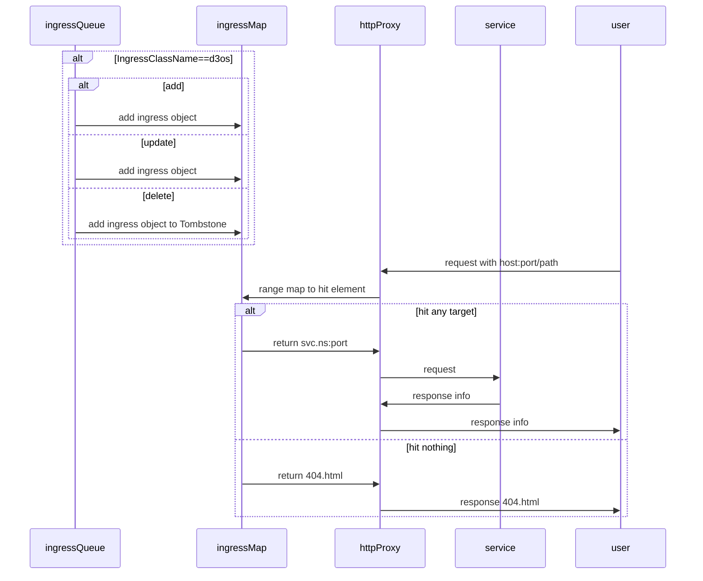

# 集群网关-开发自己的ingress控制器

### 逻辑架构

所谓ingress控制器，本质上是个controller；其监测ingress资源的变化，进行相应的修改网关配置的行为。
当用户访问时，依照当前注册进来的资源情况进行转发请求，实现反向代理。



### 代码流程

一、确定自己的controller

一般来说，controller中需要包含informer、indexer和queue三个对象

```
// Controller demonstrates how to implement a controller with client-go.
type Controller struct {
	indexer  cache.Indexer
	queue    workqueue.RateLimitingInterface
	informer cache.Controller
}

// NewController creates a new Controller.
func NewController(queue workqueue.RateLimitingInterface, indexer cache.Indexer, informer cache.Controller) *Controller {
	return &Controller{
		informer: informer,
		indexer:  indexer,
		queue:    queue,
	}
}
```

二、实现自己的controller（实例化informer、indexer和queue）

1.从master上掏.kube的config验证文件

```
config, err := clientcmd.BuildConfigFromFlags(master, kubeconfig)
if err != nil {
    klog.Fatal(err)
}
```

2.利用此配置文件，创建client，此client可以跟k8s的apiserver交互

```
clientset, err := kubernetes.NewForConfig(config)
if err != nil {
    klog.Fatal(err)
}
```

> client有四种：
>
> 1.RESTClient
>
> restclient为其他client的父类
>
> 2.ClientSet
>
> ClientSet是在RESTClient的基础上封装了对Resource和Version的管理方法。每一个Resource可以理解为一个客户端，而ClientSet是多个客户端的集合，每一个Resource和Version都以函数的方式暴露出来。ClientSer仅能访问Kubernetes自身内置的资源，不能直接访问CRD自定义的资源
>
> 3.DynamicClient
>
> DynamicClient可以对任意Kubernetes资源进行RESTFful操作，包括CRD自定义资源。DynamicClient与ClientSet操作类似，同样是封装了RESTClient。
>
> 4.DiscoveryClient
>
> DiscoveryClient是发现客户端，主要用于发现Kubernetes API Server所支持的资源组、资源版本、资源信息。除此之外，还可以将这些信息存储到本地，用户本地缓存，以减轻对Kubernetes API Server访问的压力。kubectl的api-versions和api-resources命令输出也是通过DiscoversyClient实现的

3.创建resource watcher，比如pod watcher就是监控pod的变化

```
// create the pod watcher
podListWatcher := cache.NewListWatchFromClient(clientset.CoreV1().RESTClient(), "pods", v1.NamespaceDefault, fields.Everything())
```

4.创建queue

```
// create the workqueue
queue := workqueue.NewRateLimitingQueue(workqueue.DefaultControllerRateLimiter())
```

5.创建indexer和informer

```
// Bind the workqueue to a cache with the help of an informer. This way we make sure that
// whenever the cache is updated, the pod key is added to the workqueue.
// Note that when we finally process the item from the workqueue, we might see a newer version
// of the Pod than the version which was responsible for triggering the update.
indexer, informer := cache.NewIndexerInformer(podListWatcher, &v1.Pod{}, 0, cache.ResourceEventHandlerFuncs{
    AddFunc: func(obj interface{}) {
        key, err := cache.MetaNamespaceKeyFunc(obj)
        if err == nil {
            queue.Add(key)
        }
    },
    UpdateFunc: func(old interface{}, new interface{}) {
        key, err := cache.MetaNamespaceKeyFunc(new)
        if err == nil {
            queue.Add(key)
        }
    },
    DeleteFunc: func(obj interface{}) {
        // IndexerInformer uses a delta queue, therefore for deletes we have to use this
        // key function.
        key, err := cache.DeletionHandlingMetaNamespaceKeyFunc(obj)
        if err == nil {
            queue.Add(key)
        }
    },
}, cache.Indexers{})
```

6.组装controller

```
controller := NewController(queue, indexer, informer)

// Now let's start the controller
stop := make(chan struct{})
defer close(stop)
go controller.Run(1, stop)


// Wait forever
select {}
```

三、使用http.proxy进行反向代理

从req中获得目标地址，以此作为key，去map中查找value。

value的内容是`svc.ns:port`，k8s内部可以直接访问。

```
func (c *D3osGatewayController) HandleRequestAndRedirect(res http.ResponseWriter, req *http.Request) {
   fullUrl := req.Host + req.URL.Path
   targetV := ""
   compairStr := fmt.Sprintf("%s/%s", strings.Split(req.Host, ":")[0], req.URL.Path)
   value, ok := c.ingressMap.Load(compairStr)
   if ok {
      klog.Infof("在ingressMap中找到key: %s, value: %s", compairStr, value)
      targetV = value.(string)
   }
   if targetV == "" {
      //返回404
      klog.Infof("fullUrl.ingressMap.not.found.404:%v", fullUrl)
      c.Page404Handler(res, req)
      return
   }

   // svcName + ns:port
   svcStr := targetV
   klog.Infof("fullUrl.foundsvc.print[fullUrl:%v][svcStr:%v]", fullUrl, svcStr)

   c.ServeReverseProxy(svcStr, res, req)
}
```

### 测试运行

```shell
git clone https://github.com/Dravening/d3os-gateway
go mod tidy
```

```shell
# 调整Makefile并且调整kubeconfig后执行
make total
```

```
kubectl apply -f ./deploy/deployment.yaml
kubectl apply -f ./deploy/tools/nginx-podinfo-dev.yaml
kubectl apply -f ./deploy/tools/nginx-podinfo-master.yaml
```

修改host

```
XXXXX    local.d3os.com
```

访问local.d3os.com/dev

```
curl local.d3os.com/dev
curl local.d3os.com/master
```